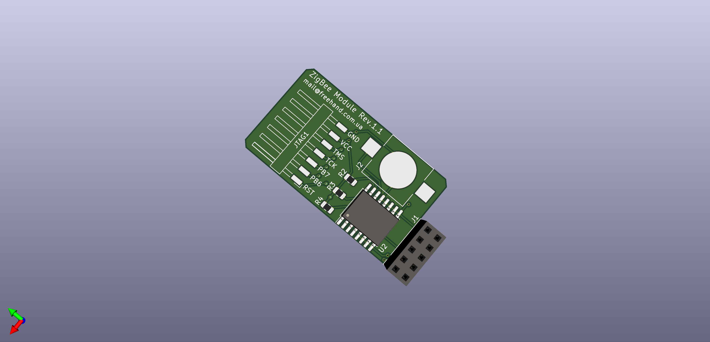

# cc2538-raspberry-pi-module

> ZigBee CC2538 Raspberry Pi module + RTC

## PCB 3D images

## Firmware
> You could flash the firmware by JTAG programmer or directly from the Raspberry Pi using [cc2538-prog](https://github.com/1248/cc2538-prog/). You have to flash a firmware with a serial bootloader (SBL).

<b>JTAG</b>
in progress

<b>Raspberry Pi (GPIO)</b>
While PowerOn a Raspberry Pi, hold down the `FLASH` button on the shield press `RESET` shortly. The CC2538 now in the bootloader.

Run 

    ./cc2538-prog -d /dev/ttyAMA0 -f MODKAMRU_V3_UART-no-flow-control_with_SBL.hex

Reset the module using the RESET button.

## RTC
Run raspi config on the terminal: 

    sudo raspi-config

- In the configuration tool, select Interfacing Option.
- Then enable I2C by selecting P5 I2C.
- After enabling the I2C.

Reboot the Pi with 

    sudo shutdown -r now

We need to install python-smbus i2c-tools to see whether our Raspberry Pi detected our I2C connection from the RTC module.

    sudo apt-get install python-smbus i2c-tools
    sudo i2cdetect -y 1

With I2C successfully setup and verified that we could see our RTC circuit then we can begin the process of configuring the Raspberry Pi to use our RTC Chip for its time.

Run the following command on your Raspberry PI to begin editing the /boot/config.txt file.

    sudo nano /boot/config.txt

Add line

    dtoverlay=i2c-rtc,ds3231

With that change made we need to restart the Raspberry Pi, so it loads in the latest configuration changes.

    sudo shutdown -r now

Once your Raspberry Pi has finished restarting we can now run the following command, this is so we can make sure that the kernel drivers for the RTC Chip are loaded in

    sudo i2cdetect -y 1

> You should see a wall of text appear, if UU appears instead of 68 then we have successfully loaded in the Kernel driver for our RTC circuit.

Now that we have successfully got the kernel driver activated for the RTC Chip and we know it’s communicating with the Raspberry Pi, we need to remove the fake hwclock package. This package acts as a placeholder for the real hardware clock when you don’t have one.

Type the following two commands into the terminal on your Raspberry Pi to remove the fake-hwclock package. We also remove hwclock from any startup scripts as we will no longer need this.

    sudo apt-get -y remove fake-hwclock
    sudo update-rc.d -f fake-hwclock remove

Now that we have disabled the fake-hwclock package we can proceed with getting the original hardware clock script that is included in Raspbian up and running again by commenting out a section of code.

Run the following command to begin editing the original RTC script.

    sudo nano /lib/udev/hwclock-set

Find and comment out the following three lines by placing # in front of it as we have done below.

    if [ -e /run/systemd/system ] ; then
        exit 0
    fi

<b>Syncing time from the Pi to the RTC module</b>

You can read the time directly from the RTC module by running the following command if you try it now you will notice it is currently way off our current real-time.

    sudo hwclock -D -r

Now before we go ahead and sync the correct time from our Raspberry Pi to our RTC module, we need to run the following command to make sure the time on the Raspberry Pi is in fact correct. If the time is not right, make sure that you are connected to a Wi-Fi or Ethernet connection.

    date

If the time displayed by the date command is correct, we can go ahead and run the following command on your Raspberry Pi. This command will write the time from the Raspberry Pi to the RTC Module.

    sudo hwclock -w

Now if you read the time directly from the RTC module again, you will notice that it has been changed to the same time as what your Raspberry Pi was set at. You should never have to rerun the previous command if you keep a battery in your RTC module.

    sudo hwclock -r

## Bill of Materials
| Name | Designator | Quantity | Footprint | Buy | Description |
|------|------------|----------|-----------|-----|-------------|
| CC2538_CC2592 | U1 | 1 | CC2538-CC2592:CC2538_CC2592 | [aliexpress](https://aliexpress.ru/item/4000955681721.html) | Chinese CC2538_CC2592 zigbee module | 
| DS3231M | U2 | 1 | Package_SO:SOIC-16W_7.5x10.3mm_P1.27mm | [aliexpress](https://aliexpress.ru/item/4000106115557.html) | |
| Conn_01x07 | JTAG1 | 1 | Connector_Harwin:Harwin_M20-89007xx_1x07_P2.54mm_Horizontal | [aliexpress](https://aliexpress.ru/item/32821748577.html) | |
| Conn_02x05 | J1 | 1 |Connector_PinSocket_2.54mm:PinSocket_2x05_P2.54mm_Vertical | [aliexpress](https://aliexpress.ru/item/33004522737.html) | | 
| BK-870 | J2 | 1 | MPD_BK-870 | [aliexpress](https://aliexpress.ru/item/33014348787.html) | |
| B3U-1000P | SW1, SW2 | 2 | Button_Switch_SMD:SW_SPST_B3U-1000P | [aliexpress](https://aliexpress.ru/item/32623923874.html) | | 
| 1k | R1| 1 | Resistor_SMD:R_0805_2012Metric | | |
| 10k | R2, R3, R4 | 3 | Resistor_SMD:R_0805_2012Metric | | | 
| 33uF | C1 | 1 | Capacitor_Tantalum_SMD:CP_EIA-3216-18_Kemet-A | [aliexpress](https://aliexpress.ru/item/4001241518347.html) | A 10V33UF 336 | 
| IPEX_RP-SMA-K | | 1 | | [aliexpress](https://aliexpress.ru/item/10000000385894.html) | SMA Female |

## Links
* Z-Stack Firmware - https://github.com/Koenkk/Z-Stack-firmware
* UART Version of the Z-Stack firmware - https://github.com/reverieline/CC2538-CC2592-ZNP/tree/master/MODKAMRU_V3
* Kicad symbol, footprint, 3D model for CC2538-CC2592 Zigbee RF module. - https://github.com/uzsito/CC2538-CC2592-kicad-component
* Programmer for CC2538 backdoor UART bootloader - https://github.com/1248/cc2538-prog/
* Raspberry Pi UART configuration - https://www.raspberrypi.org/documentation/configuration/uart.md
